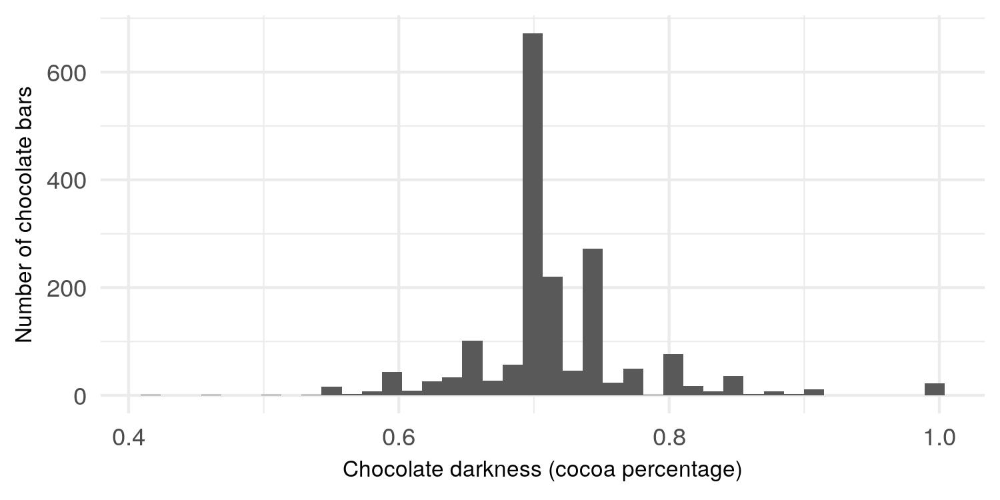
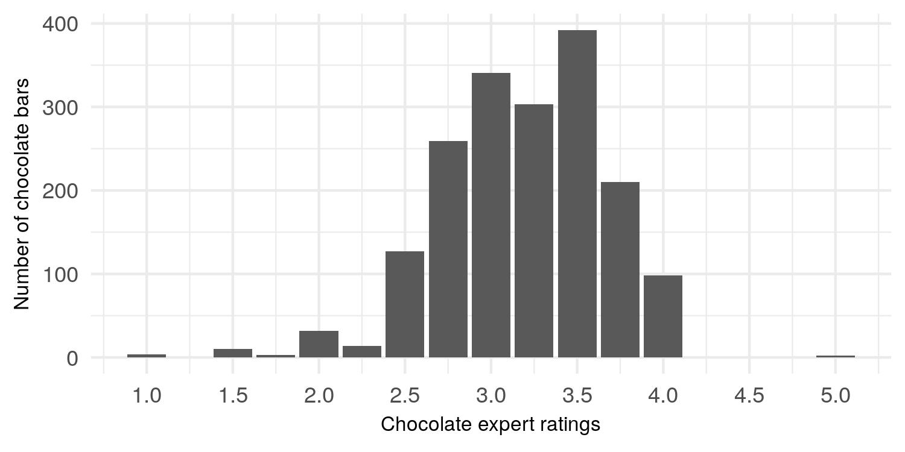
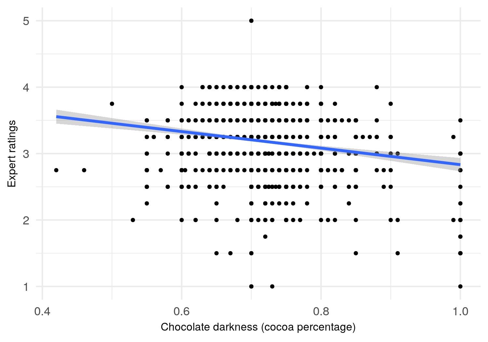
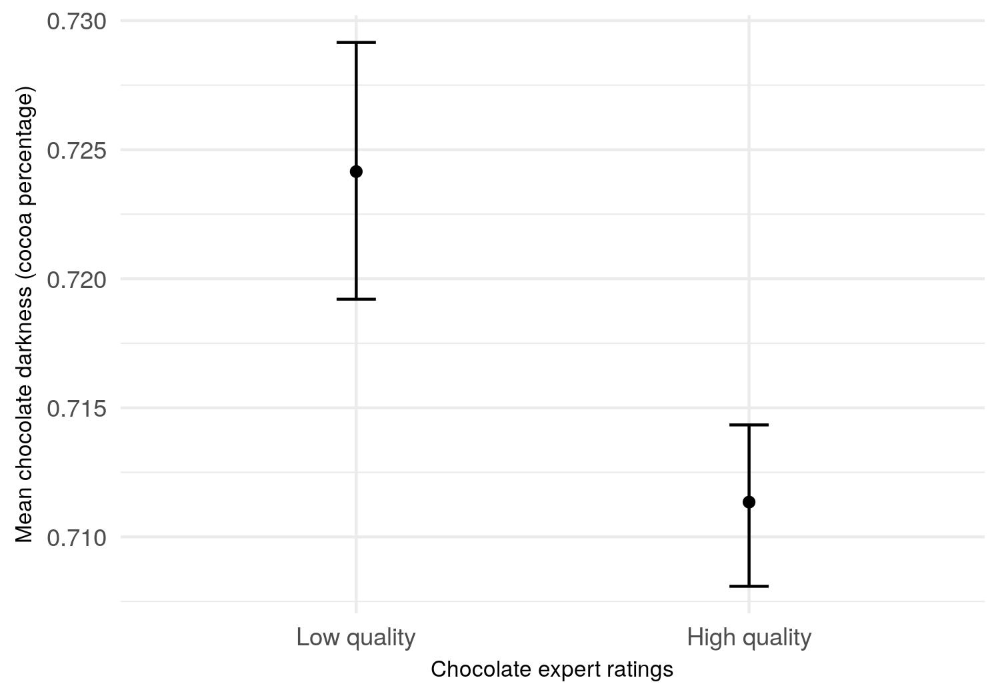

Chocolate bar rating analysis
================
Bailey Lei, George J. J. Wu
November, 2018

Chocolate bar is one of the most popular treats around the world, but
not all chocolate bars are made the same. Some chocolate bars are made
with a high concentration of cocoa beans and are thus considered more
dark, while some chocolate bars are far less concentrated in terms of
cocoa and are thus considered more light.

This begs a question - are darker chocolate bars simply better? For
instance, in the eyes of the experts, are chocolate bars with 99% cocoa
concentration simply better than chocolate bars with only 70% cocoa
concentration?

This analysis would explore the relationship between chocolate darkness
(cocoa percentage) and chocolate expert ratings.

### Data set

We examined the expert ratings of 1,795 chocolate bars compiled by Brady
Brelinski, a Founding Member of the [Manhattan Chooclate
Society](http://flavorsofcacao.com/index.html). A detailed description
of the data set can be found on
[Kaggle](https://www.kaggle.com/rtatman/chocolate-bar-ratings). We were
particularly interested in two variables in the data - chocolate
darkness (cocoa percentage) and expert ratings.

We began our analysis by examining each variable individually.

### Chocolate darkness

First, we examined the chocolate darkness variable visually.

<!-- -->

*Figure 1.* Distribution of chocolate darkness.

We also examined chocolate darkness numerically.

*Table 1.* Descriptive statistics of chocolate darkness.

| minimum |  q1 | median |      mean |   q3 | maximum |
| ------: | --: | -----: | --------: | ---: | ------: |
|    0.42 | 0.7 |    0.7 | 0.7169833 | 0.75 |       1 |

Note that `q1` represents the 25% quantile, and `q3` represents the 75%
quantile.

Both visual and numerical examinations revealed that the vast majority
of chocolate bars in the data set had a cocoa concentration of about
70%. The most concentrated chocolate bars in the data set attained 100%
cocoa purity, whereas the least concentrated chocolate bars had a cocoa
percentage of only 42%. The distribution of chocolate darkness is
somewhat normal.

### Chocolate expert ratings

Next, we examined chocolate expert ratings visually.

<!-- -->

*Figure 2.* Distribution of chocolate expert ratings.

We also examined chocolate expert ratings numerically.

*Table 2.* Descriptive statistics of chocolate darkness.

| minimum |    q1 | median |     mean |  q3 | maximum |
| ------: | ----: | -----: | -------: | --: | ------: |
|       1 | 2.875 |   3.25 | 3.185933 | 3.5 |       5 |

Note that `q1` represents the 25% quantile, and `q3` represents the 75%
quantile.

Each chocolate bar was rated by experts using a [Likert
scale](https://en.wikipedia.org/wiki/Likert_scale). Some of the main
encodings were: 1 is unpleasant, 2 is disappointing, 3 is satisfactory
(3.75 is praiseworthy), 4 is premium, and 5 is elite. A more detailed
description of the rating system can be found on
[Kaggle](https://www.kaggle.com/rtatman/chocolate-bar-ratings/home).

Most chocolate bars in the data set were given a rating of around 3 to
3.5, with 1 being the lowest rating given, and 5 being the highest
rating given. The distribution of chocolate expert ratings seemed to be
slightly left-skewed.

### Chocolate darkness and expert ratings

Let’s explore the relationship between chocolate darkness and expert
ratings. Expert ratings is an ordinal variable with more than five
categories. For this reason, we would first treat expert ratings simply
as a continuous variable, followed by an analysis in which it would also
be treated as a categorical variable.

#### Expert ratings as a continuous variable

For this part of our analysis, we would explore the relationship between
chocolate darkness and expert ratings, under the assumption that their
relationship to be linear, and that expert ratings to be a continuous
variable.

<!-- -->

*Figure 3.* Chocolate darkness and expert ratings. Grey section
represents 95% confidence intervals for the line of best fit (blue
line), generated using linear regression.

We also computed the [Pearson’s correlation
coefficient](https://en.wikipedia.org/wiki/Pearson_correlation_coefficient)
and its p-value between the two variables.

*Table 3.* Pearson’s correlation coefficient and its
p-value

|    estimate | statistic | p.value | parameter |    conf.low |   conf.high | method                               | alternative |
| ----------: | --------: | ------: | --------: | ----------: | ----------: | :----------------------------------- | :---------- |
| \-0.1648202 | \-7.07589 |       0 |      1793 | \-0.2094894 | \-0.1194644 | Pearson’s product-moment correlation | two.sided   |

There was a weak and negative correlation between the two variables (r =
-.1648, n = 1793, p \< 0.0001). Both `Figure 3.` and the results in
`Table 3.` seemed to be suggesting that chocolate darkness is weakly and
negatively associated with chocolate expert ratings. In other words, as
the cocoa percentage of chocolate bars increases, chocolate experts tend
to give somewhat lower ratings.

#### Expert ratings as a categorical variable

We would next treat chocolate expert ratings as a categorical variable.
To simplify comparisons, this analysis further categorized chocolate
bars with 3 or lower ratings as `low quality` chocolate (n = 790), and
chocolate bars with greater than 3 ratings as `high quality` chocolate
(n = 1005).

We then compared the mean chocolate darkness (cocoa percentage) between
the two expert ratings or quality groups.

<!-- -->

*Figure 4.* Mean chocolate darkness (cocoa percentage) by expert ratings
groups. Error bars represent 95% confidence intervals for each mean
estimate.

As suggested by `Figure 4.`, high quality chocolate bars seemed to have
lower cocoa concentration. Let’s formally test this observation by
conducting a [Welch’s
t-test](https://en.wikipedia.org/wiki/Welch%27s_t-test). We chose to use
a Welch’s t-test because the two chocolate quality groups differed in
sample size, and we assumed that the variance of the two quality groups
to be different.

We would be testing the following null and alternative hypothesis:

\(H_0\): The mean chocolate darkness (cocoa percentage) of the high
quality chocolate is *no different* than that of the low quality
chocolate.

\(H_A\): The mean chocolate darkness (cocoa percentage) of the high
quality chocolate is *different* than that of the low quality chocolate.

*Table 4.* Welch’s t-test and its
p-value

|  statistic |  p.value | parameter |    conf.low |   conf.high | method                  | alternative |
| ---------: | -------: | --------: | ----------: | ----------: | :---------------------- | :---------- |
| \-4.075533 | 4.87e-05 |  1288.021 | \-0.0189668 | \-0.0066405 | Welch Two Sample t-test | two.sided   |

As indiciated by `Table 4.`, there was enough evidence to reject the
null hypothesis. There was a significant difference in the mean cocoa
percentage for low quality (M = 0.7242, SD = 0.0765) chocolate bars and
high quality (M = 0.711, SD = 0.0497) chocolate bars; t(1288) = -4.0755,
p \< 0.0001. In other words, low quality chocolate bars on average tend
to be more dark, comparing to high quality chocolate bars.

### Summary

We observed that chocolate experts tend to give somewhat lower ratings
as chocolate became more dark. We also observed that low quality
chocolate tends to be more dark than high quality chocolate. Both
observations suggest that darker chocolate bars are not necessarily
better chocolate bars.

### Limitations and future directions

There were a number of limitations with the current analysis.

We have not yet considered the scenarios in which the relationship
between chocolate darkness and ratings could be non-linear. For
instance, maybe experts prefer chocolate that is not too dark, or not
too light, but with just the right amount of cocoa. We can explore these
scenarios in the future by computing [Kendall’s
tau](https://en.wikipedia.org/wiki/Kendall_rank_correlation_coefficient)
correlation coefficient instead, or by fitting a smooth line over our
scatter plot using
[LOESS](https://en.wikipedia.org/wiki/Local_regression) instead.

We also did not consider other factors that can influence the ratings of
the chocolate bars, such as the origin and quality of the cocoa beans,
as well as the company that produced the chocolate bars. We can explore
the potential interactions among these variables in the future.

### References

[Chocolate bar
ratings](https://www.kaggle.com/rtatman/chocolate-bar-ratings/home) by
Rachael Tatman

[Cacao vs Cocoa: The difference and why it
matters](https://blog.paleohacks.com/cacao-vs-cocoa/#) by Corey
Pemberton

[Can Likert scale data ever be
continuous?](https://www.theanalysisfactor.com/can-likert-scale-data-ever-be-continuous/)
by Karen Grace-Martin
